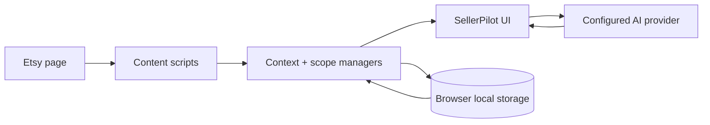

<div align="center">

# SellerPilot for Etsy

### A context-aware AI browser assistant for Etsy sellers

[](#)
[](#)
[](#)
[](./LICENSE)

**AI help where the work actually happens — inside Etsy pages, listings, and conversations.**

[Features](#features) · [Install](#install-from-source) · [Privacy](#privacy) · [Architecture](#how-it-works) · [Contributing](#contributing)

</div>

> **Project naming:** the public project/repository brand is **SellerPilot for Etsy**. The current browser-extension package name in `manifest.json` remains **Etsy AI Assistant** for compatibility with the existing extension/release identity.

## What it does

SellerPilot adds an AI assistant directly to Etsy seller workflows. Instead of working as a separate chatbot with no context, it can use the Etsy page you are currently viewing, listing information, conversation history, saved preferences, and supported customer images to produce more relevant answers and reply drafts.

The project is designed to stay **local-first**: extension state is stored in the browser, AI requests go directly to the provider configured by the user, and no developer-operated backend is required for normal AI requests.

## Features

### Context-aware assistant

- Floating AI chat available on Etsy pages
- Current page and page-type awareness
- Listing context and multi-listing discovery
- Etsy conversation context with per-conversation isolation
- Context freshness and scope guards to reduce stale or cross-chat data

### Seller workflow tools

- Customer reply drafting without automatic sending
- Reusable quick replies and AI-managed reply templates
- Local assistant memory for persistent seller preferences
- Custom shop-specific instructions
- Listing-aware assistance inside supported Etsy workflows

### Image-aware workflows

- Customer-image discovery from supported Etsy conversations
- Image analysis with bounded concurrency and caching
- Guardrails around sender role, stale context, and unavailable images

### AI providers

- Google Gemini support with streaming responses and fallback handling
- OpenRouter integration
- Optional DeepSeek and Grok provider paths
- Custom OpenAI-compatible endpoint support
- User-provided credentials only — no API keys are shipped with the project

### Cross-browser source tree

- Chrome / Chromium
- Microsoft Edge
- Firefox build generation from the same source manifest

## How it works



The extension uses content scripts to observe the current Etsy context, stores user settings and local working state in browser extension storage, and sends only the context required for an enabled AI feature to the provider selected by the user.

For the detailed component map and trust boundaries, see [ARCHITECTURE.md](./ARCHITECTURE.md).

## Privacy

SellerPilot does **not** include API keys, Etsy account credentials, customer exports, or a developer-operated analytics service.

Locally stored data can include:

- provider API credentials
- assistant preferences and custom instructions
- local memory and quick replies
- chat history used by the extension
- cached Etsy page, listing, and conversation context
- derived image-analysis metadata

The extension does **not** add its own encryption layer around browser local storage.

When an AI feature needs Etsy context, relevant page, listing, conversation, or image data may be sent directly to the selected provider. A custom OpenAI-compatible provider receives data at the endpoint configured by the user.

Read the full [Privacy Policy](./PRIVACY_POLICY.md) before using the extension with real seller/customer data.

## Install from source

### Chrome / Edge

1. Clone or download this repository.
2. Open `chrome://extensions/` or `edge://extensions/`.
3. Enable **Developer mode**.
4. Choose **Load unpacked**.
5. Select the `src/` directory.
6. Open extension settings and configure your own AI provider credentials.

### Firefox development build

On Windows, run:

```cmd
build.bat
```

Then open `about:debugging#/runtime/this-firefox` and load:

```text
dist/firefox/manifest.json
```

The build also creates a Firefox XPI for normal signing/release workflows.

## Build

`src/manifest.json` is the single source of truth for the browser manifest.

```cmd
build.bat
```

Generated output:

```text
dist/chrome/      Chromium package contents
dist/firefox/     Firefox package contents
dist/*.xpi        Packaged Firefox development build
```

See [BUILD_INSTRUCTIONS.md](./BUILD_INSTRUCTIONS.md) for more detail.

## Project structure

```text
src/
├── background/   background service worker and privileged operations
├── common/       shared browser helpers
├── config/       assistant policy and base instructions
├── content/      Etsy integration, context, AI providers, UI and guards
├── libs/         vendored browser-side libraries
├── offscreen/    Chromium offscreen parsing support
└── options/      extension settings UI

tests/            automated tests and synthetic fixtures
.github/          repository and release automation metadata
```

## Security model

The project intentionally treats Etsy/customer content and provider credentials as sensitive data.

- Never commit API keys, browser cookies, Etsy exports, customer conversations, private screenshots, or browser profiles.
- Tests and public examples must use synthetic data.
- Store-release credentials belong in GitHub Actions secrets.
- Custom AI endpoints require optional host access because their hostname is chosen by the user at runtime.
- Generated customer replies are drafts and should be reviewed before sending.

For vulnerability reporting and credential-exposure guidance, see [SECURITY.md](./SECURITY.md).

## Development

There is no required application backend and no package-install step for the core extension source.

Typical development loop:

1. edit files under `src/`
2. reload the unpacked extension in the browser
3. run the relevant tests
4. use `build.bat` when a packaged cross-browser build is needed

Contributor and AI-agent guidance lives in [CONTRIBUTING.md](./CONTRIBUTING.md) and [AGENTS.md](./AGENTS.md).

## Contributing

Issues, bug reports, focused improvements, and pull requests are welcome.

Before contributing:

- read [CONTRIBUTING.md](./CONTRIBUTING.md)
- use synthetic/redacted examples
- keep security and conversation-isolation boundaries intact
- do not trigger store-release workflows unless a maintainer explicitly intends a release

## Documentation

| Document | Purpose |
| --- | --- |
| [ARCHITECTURE.md](./ARCHITECTURE.md) | Components, data flow, trust boundaries |
| [BUILD_INSTRUCTIONS.md](./BUILD_INSTRUCTIONS.md) | Local Chrome/Edge/Firefox build process |
| [PRIVACY_POLICY.md](./PRIVACY_POLICY.md) | Data collection, storage, and provider disclosure |
| [SECURITY.md](./SECURITY.md) | Security reporting and credential guidance |
| [CONTRIBUTING.md](./CONTRIBUTING.md) | Contribution rules |
| [AGENTS.md](./AGENTS.md) | Repository guidance for coding agents |
| [THIRD_PARTY_NOTICES.md](./THIRD_PARTY_NOTICES.md) | Vendored dependency attribution |

## Roadmap ideas

Public contributions are especially useful around:

- broader browser compatibility
- stronger automated test coverage
- Etsy UI-change resilience
- permission minimization
- accessibility and keyboard navigation
- privacy-preserving diagnostics

## Disclaimer

SellerPilot for Etsy is an independent open-source project. It is **not affiliated with, endorsed by, or sponsored by Etsy, Inc.** Etsy pages and internal APIs can change without notice and may break integration behavior.

## License

Released under the [MIT License](./LICENSE).

Vendored third-party code keeps its original upstream licensing and attribution; see [THIRD_PARTY_NOTICES.md](./THIRD_PARTY_NOTICES.md).
